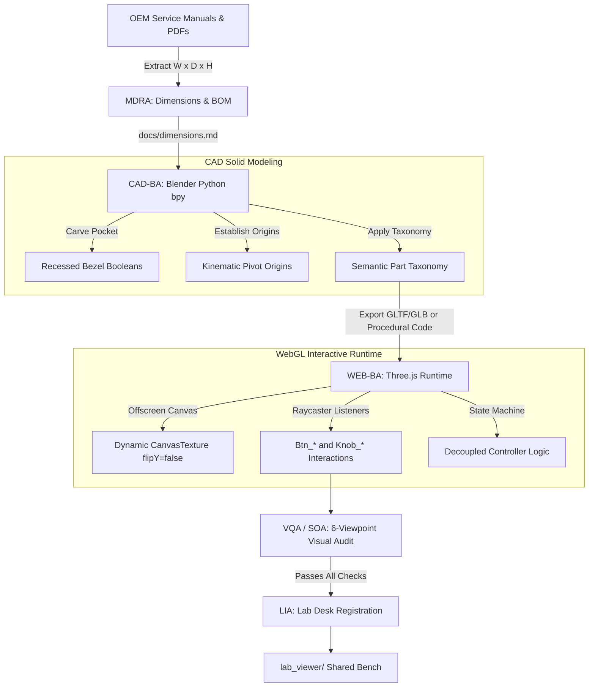

# Twins System Architecture Blueprint
## The Hybrid CAD-to-Web Pipeline

This document defines the technical architecture connecting real-world OEM service manuals to live, interactive WebGL digital twins.

---

## 1. System Pipeline Diagram

---

## 2. Structural Layering

### Layer 1: Research & Specifications (`<twin>/research/` & `docs/`)
- Ingests manufacturer user and service manuals.
- Formulates `PRODUCT_BRIEF.md`, `dimensions.md`, `BOM.md`, and `control_spec.md`.

### Layer 2: Mechanical Solids & Kinematics (`<twin>/cad/`)
- Blender scripts (`create_*.py`) using `bpy` and procedural boolean modifiers.
- Models physical hardware down to M3/M4 hex socket cap screws and vulcanized rubber leveling feet.
- Kinematic moving parts (`Pivot_*`) set their local coordinate origins exactly at the rotation or translation axis.

### Layer 3: Decoupled Controller (`<twin>/software/controller/`)
- Clean Python or JS state machines governing instrument physics, PID heat loops, interlocks, and run timers.
- Verified by standalone unit tests (`scripts/test.sh`).

### Layer 4: Interactive WebGL Runtime (`<twin>/software/viewer/`)
- Three.js WebGL application importing meshes or running procedural JavaScript geometry generators.
- Dynamic HTML5 `<canvas>` bound as `THREE.CanvasTexture` for live LCD displays (`flipY = false`).
- Raycaster click handlers bound to `Btn_*` and `Knob_*`.

### Layer 5: Lab Desk Multi-Instrument Workspace (`lab_viewer/`)
- Master desk environment with OrbitControls and machine picker.
- Implements slide-out / slide-in transitions between instruments.
- Registered in `lab_viewer/machines/registry.js`.
