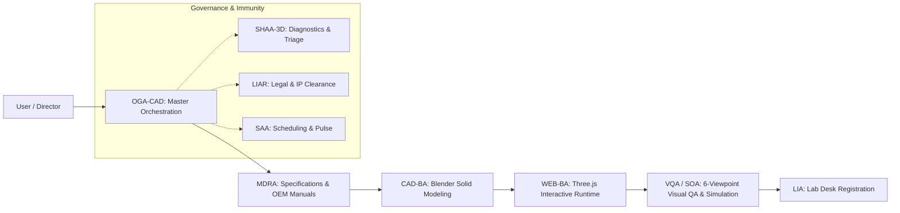

# Twins Agent Workforce Communication & Handoff Matrix

| Agent | Input From | Primary Output | Hand Off To |
| :--- | :--- | :--- | :--- |
| **OGA-CAD** | Human User | Approved project plan & constraints | MDRA / CAD-BA |
| **MDRA** | OEM Service Manuals | `docs/dimensions.md` & `BOM.md` | CAD-BA, LIAR |
| **CAD-BA** | `dimensions.md` | Procedural solids (`create_*.py`), recessed bezels | WEB-BA |
| **WEB-BA** | CAD script / export | Three.js viewer, dynamic LCD, raycasting controls | VQA / SOA |
| **VQA / SOA** | Live viewer on port 8765 | 6-viewpoint visual inspection & 6-pillar report | LIA (if pass) or SHAA-3D (if fail) |
| **SHAA-3D** | Error logs & visual flaws | Minimal non-breaking fix & `[ISS-XXX]` entry | OGA-CAD / WEB-BA |
| **LIA** | Verified twin package | `lab_viewer/machines/registry.js` registration | OGA-CAD for sign-off |
