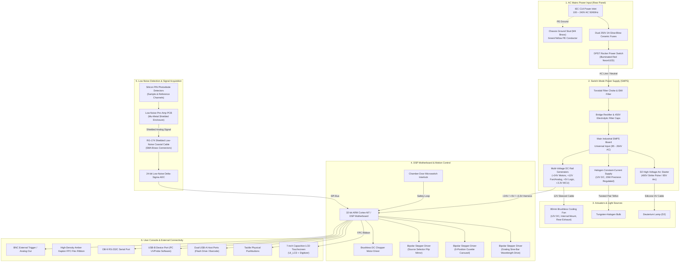

# Engineering Schematics & Architecture — UV-1900i Spectrophotometer

Comprehensive technical reference, optical ray trace schematics, electrical wiring diagrams, and sample measurement principles for the **Shimadzu UV-1900i Dual-Beam UV-Vis Spectrophotometer**.

---

## 1. How Samples Are Tested (Optical vs. Fluidic Routing)

> [!IMPORTANT]
> **Core Principle: Liquid Samples Do NOT Flow or Route Through Tubes.**  
> In standard UV-Vis spectrophotometers, liquid samples are **not pumped, routed, or transported through tubing** (unlike HPLC, continuous flow analyzers, or peristaltic sippers).
>
> Instead:
> 1. The liquid sample is pipetted into a **precision optical cuvette** (typically a standard $12.5 \times 12.5 \times 45\text{ mm}$ synthetic fused silica quartz or optical glass cell with a calibrated $10.0\text{ mm}$ optical pathlength).
> 2. The cuvette is placed manually into a holder inside the **light-tight sample compartment** (in the UV-1900i, a motorized 6-position rotary carousel turret).
> 3. The light-tight chamber door is closed, engaging safety microswitch interlocks.
> 4. **The monochromatic LIGHT BEAM is what travels through the machine, passing directly THROUGH the sample liquid.**
> 5. The detector measures the photon attenuation (absorbed light), calculating Transmittance ($T$) and Absorbance ($A$) according to the **Beer-Lambert Law**:
>    $$A = -\log_{10}(T) = -\log_{10}\left(\frac{I}{I_0}\right) = \varepsilon \cdot c \cdot l$$
>    where:
>    - $I_0$ = Incident beam intensity (measured via reference channel / blank).
>    - $I$ = Transmitted beam intensity exiting the sample cuvette.
>    - $\varepsilon$ = Molar absorptivity of the analyte ($\text{L}\cdot\text{mol}^{-1}\cdot\text{cm}^{-1}$).
>    - $c$ = Sample concentration ($\text{mol}\cdot\text{L}^{-1}$).
>    - $l$ = Optical pathlength ($1.0\text{ cm} = 10\text{ mm}$).

---

## 2. Optical Train Schematic (Czerny-Turner Double-Beam Monochromator)

```mermaid
flowchart TD
    subgraph LIGHT_SOURCES ["1. Light Sources Bay"]
        D2["Deuterium Arc Lamp (D2)<br/>190 – 340 nm (UV)"]
        W["Tungsten-Halogen Lamp (WI)<br/>340 – 1100 nm (Vis/NIR)"]
        SEL{"Source Selection<br/>Rotary Mirror<br/>(Flips at 340 nm)"}
        D2 -->|UV Arc| SEL
        W -->|Vis Beam| SEL
    end

    subgraph MONOCHROMATOR ["2. Czerny-Turner Monochromator (Sealed)"]
        SLIT_IN["Entrance Slit<br/>(1.0 nm Bandwidth)"]
        COL_MIRROR["Collimating Concave Mirror<br/>(Converts diverging to parallel beam)"]
        GRATING["Holographic Blazed Grating<br/>(1200 lines/mm LO-RAY-LIGH)<br/>Precision Stepper Motor Drive"]
        FOC_MIRROR["Focusing Concave Mirror<br/>(Refocuses dispersed spectral fan)"]
        SLIT_OUT["Exit Slit<br/>(Isolates pure monochromatic wavelength λ)"]
        FILTER["Motorized Order-Sorting<br/>Filter Wheel (6 Cutoff Filters)"]

        SEL -->|White Light| SLIT_IN
        SLIT_IN --> COL_MIRROR
        COL_MIRROR -->|Parallel Beam| GRATING
        GRATING -->|Dispersed Spectrum| FOC_MIRROR
        FOC_MIRROR --> SLIT_OUT
        SLIT_OUT --> FILTER
    end

    subgraph BEAM_SPLITTER ["3. Dual-Beam Modulator"]
        CHOPPER["Rotating Sector Chopper Wheel<br/>(Alternate Mirror / Window / Black Sector)"]
        REF_MIRROR["Reference Fold Mirrors<br/>(Channel M1 & M2)"]
        FILTER -->|Pure Monochromatic λ| CHOPPER
    end

    subgraph SAMPLE_CHAMBER ["4. Sample Compartment & Measurement"]
        SAMPLE_BEAM["Sample Beam (I)<br/>Passes Entry Aperture"]
        CUVETTE["Active 10mm Quartz Cuvette<br/>(Stationary Liquid Sample)"]
        SAMPLE_DET["Sample Photodiode Detector<br/>(Low-Noise Silicon PIN)"]

        CHOPPER -->|Beam Transmitted| SAMPLE_BEAM
        SAMPLE_BEAM --> CUVETTE
        CUVETTE -->|Attenuated Beam (I)| SAMPLE_DET

        REF_BEAM["Reference Beam (I0)"]
        REF_CUVETTE["Reference / Blank Cuvette<br/>(Solvent / Air)"]
        REF_DET["Reference Photodiode Detector<br/>(Monitors Incident I0)"]

        CHOPPER -->|Beam Reflected| REF_MIRROR
        REF_MIRROR --> REF_BEAM
        REF_BEAM --> REF_CUVETTE
        REF_CUVETTE --> REF_DET
    end

    subgraph SIGNAL_PROCESSING ["5. Signal Processing & Analysis"]
        PREAMP["Ultra-Low-Noise Pre-Amplifier PCB<br/>(Transimpedance Amplifier)"]
        ADC["24-bit Delta-Sigma Analog-to-Digital Converter"]
        DSP["32-bit DSP Microprocessor<br/>(Calculates A = -log10(I / I0))"]
        LCD["7-inch Color Capacitive Touchscreen UI<br/>(Displays Spectrum & Absorbance)"]

        SAMPLE_DET --> PREAMP
        REF_DET --> PREAMP
        PREAMP --> ADC
        ADC --> DSP
        DSP --> LCD
    end
```

### Optical Path Step-by-Step

1. **Light Sources Bay (Rear Left):**
   - **Deuterium ($D_2$) Lamp:** Provides intense, continuous ultraviolet radiation from $190$ to $340\text{ nm}$.
   - **Tungsten-Halogen (WI) Lamp:** Provides smooth visible and near-infrared radiation from $340$ to $1100\text{ nm}$.
   - **Source Selection Mirror:** A motorized silver front-surface mirror automatically flips between lamps at the $340\text{ nm}$ crossover threshold.
2. **Czerny-Turner Monochromator (Center Bay):**
   - Light passes through the **Entrance Slit**, striking the off-axis **Collimating Concave Mirror**.
   - The collimated parallel beam illuminates the **1200 lines/mm LO-RAY-LIGH Holographic Grating**, dispersing white light into its constituent spectral angles ($\sin\alpha + \sin\beta = m \cdot \lambda \cdot N$).
   - The dispersed light strikes the **Focusing Concave Mirror**, focusing the spectral fan across the **Exit Slit**, which transmits only the target wavelength $\lambda$ (e.g., $525.0\text{ nm} \pm 0.5\text{ nm}$).
   - The beam passes through the **Order-Sorting Filter Wheel** to eliminate second-order diffraction harmonics ($\lambda/2$).
3. **Rotating Sector Chopper (Double-Beam Modulation):**
   - A motor-driven rotating disc with mirrored and open sectors splits the monochromatic beam in time:
     - When the mirror sector passes, light is diverted via fold mirrors through the **Reference Channel** ($I_0$).
     - When the open aperture passes, light travels through the **Sample Channel** ($I$).
     - When the dark sector passes, the detector reads dark current noise for real-time baseline subtraction.
4. **Sample Compartment:**
   - The sample beam enters through a precision collimator aperture into the black anodized sample chamber.
   - The beam traverses the $10\text{ mm}$ optical pathlength of the quartz cuvette, passing directly through the liquid meniscus.
   - The exiting light passes through an exit lens aperture into the enclosed detector cavity.
5. **Photodiode Detector Bay:**
   - High-sensitivity silicon photodiode sensors convert light photons into picoampere currents ($pA$).
   - Low-noise operational transimpedance amplifiers convert current to voltage, digitized by a high-resolution 24-bit ADC for digital absorbance calculation.

---

## 3. Electrical & Wiring Schematic



---

## 4. Rear Bulkhead Panel Layout & Component Legend

When viewing the instrument from the rear (`CAM_REAR`), the components are laid out in a standardized, service-accessible topology:

```
+-----------------------------------------------------------------------------------+
|  [SHIMADZU UV-1900i]                        [REAR EXHAUST VENTILATION BAY]        |
|  MODEL: UV-1900i                            +-----------------------------+       |
|  SERIAL: 2026-SRE-8841                      | /////////////////////////// |       |
|  MADE IN KYOTO, JAPAN                       | /////////////////////////// |       |
|                                             | /////////////////////////// |       |
|                                             | //  INTERNAL 80mm FAN   /// |       |
|                                             | //  BEHIND PROTECTIVE   /// |       |
|                                             | //  RECESSED LOUVERS    /// |       |
|                                             +-----------------------------+       |
|                                                                                   |
|  +-------+   +-------+   +-----+ +-----+   +---------+   (O) BNC                  |
|  | [ | ] |   | [0/1] |   | [=] | | [=] |   | ::::::  |   TRIG                     |
|  | C14   |   | POWER |   | USB | | USB |   | DB9     |   OUT                      |
|  +-------+   +-------+   +-----+ +-----+   +---------+                            |
|    (1)          (2)        (3)     (4)         (5)       (6)                      |
+-----------------------------------------------------------------------------------+
```

### Rear Bulkhead Component Specifications:

1. **IEC C14 AC Power Inlet (1):**
   - Standard 3-pin male IEC 60320 C14 receptacle with integral dual $5 \times 20\text{ mm}$ ceramic fuse drawer ($250\text{V}, 2\text{A}$ slow-blow).
   - Receives the molded female IEC C13 plug of the heavy-duty SJTOW AC power cord.
2. **Double-Pole Rocker Power Switch (2):**
   - Illuminated red DPST mains power switch ($250\text{V}, 6\text{A}$). Completely isolates both Line ($L$) and Neutral ($N$) conductors when switched off.
3. **Dual USB-A Host Ports (3 & 4):**
   - Connects USB flash drives for direct CSV/PDF spectral data export, barcode scanners for sample ID entry, or commercial USB printers.
4. **DB-9 RS-232C Serial Port (5):**
   - Standard 9-pin D-sub female connector for legacy laboratory automation, LIMS integration, and external titrators.
5. **BNC External Trigger / Analog Output (6):**
   - $50\,\Omega$ female BNC connector providing analog absorbance voltage ($0\text{--}1\text{V}$ full scale) or external hardware trigger input for synchronized kinetic stop-flow experiments.
6. **Internal Cooling Fan & Recessed Exhaust Louvers:**
   - Industrial $80\times 80\times 25\text{ mm}$ brushless $12\text{V DC}$ ball-bearing fan mounted **completely inside** the chassis ($Z = 2.22$).
   - Draws cooling air through intake vents across the lamp house and power supply, discharging warm air rearward through recessed downward-angled louvers.
   - Guarded internally by a stamped wire finger guard mesh; zero fan components ever penetrate or protrude past the rear chassis wall.

---

## 5. Physical Wiring Harness Details (Inside the 3D Twin)

In compliance with the **Centrifuge Standard** and **Exhaustive Procedural Detail (Zero Size Limits)**, all internal wiring is represented as genuine 3D physical meshes:

| Harness Name | Conductor Spec | Path & Routing | Termination |
| :--- | :--- | :--- | :--- |
| **AC Mains Harness** | 3-conductor $16\text{ AWG}$ braided black sleeve (Live: Black, Neutral: White, PE: Green/Yellow) | C14 inlet $\to$ Rocker switch $\to$ SMPS input terminal block | Quick-connect insulated spade terminals |
| **Chassis Ground Strap** | $14\text{ AWG}$ Green/Yellow insulated stranded copper | IEC ground pin $\to$ Die-cast aluminum baseplate | M4 brass grounding stud with star washer (`Fastener_GroundLug_M4`) |
| **High-Voltage $D_2$ Cable** | Silicone-insulated $10\text{ kV}$ rated orange cable ($\varnothing 3.2\text{ mm}$) | SMPS arc ignition module $\to$ Deuterium lamp top ceramic insulator cap | Ceramic high-voltage boots with internal crimp contacts |
| **Halogen Lamp Leads** | Twisted-pair PTFE high-temperature white/brown wire | SMPS constant-current regulator $\to$ Lamp socket G4 bracket | Ceramic heat-resistant bi-pin receptacle |
| **Grating Stepper Ribbon** | 4-conductor flat color-coded ribbon (Red/Blue/Green/Black) | Motherboard stepper driver $\to$ Monochromator sine-bar motor | 4-pin JST-XH keyed locking connector |
| **Turret Indexer Ribbon** | 4-conductor flat ribbon | Motherboard $\to$ Carousel drive motor beneath chamber floor | 4-pin JST-XH connector |
| **Detector Signal Cable** | RG-174 shielded low-noise flexible coaxial cable ($\varnothing 2.8\text{ mm}$) | Pre-amp PCB inside mu-metal chamber $\to$ Motherboard 24-bit ADC | Gold-plated brass threaded SMA connectors |
| **Touchscreen FPC Ribbon** | Flexible Printed Circuit (FPC) amber Kapton polyimide tape | Motherboard digital display controller $\to$ Back of 7" LCD digitizer | 40-pin zero-insertion-force (ZIF) socket |
| **Cooling Fan Cable** | 3-wire ribbon (Red $+12\text{V}$, Black GND, Yellow Tachometer) | Cooling fan frame $\to$ Motherboard 12V fan header | 3-pin Molex KK connector |
| **Rear Bulkhead Harnesses** | DB-9 9-conductor ribbon, Dual USB twisted-pair, BNC RG-174 coax | Rear panel I/O ports $\to$ Motherboard rear headers | Keyed IDC connectors & SMA connectors |

---

## 6. Optical Sector Chopper Subsystem (`Assembly_OpticalChopper`)

The dual-beam rotating sector chopper is a core electro-mechanical component that splits the monochromatic light beam into alternating Sample ($I$) and Reference ($I_0$) optical channels.

```
       [U-Channel Opto Sensor]
                 ||
            +----+----+
          /      |      \
        /    [MIRROR]    \
       |  (0° to 90°)     |
       |                  |
[HUB]--+                  +--- [DRIVE SHAFT]
       |  (180° to 270°)  |          |
        \    [MIRROR]    /     [BLDC MOTOR]
          \      |      /            |
            +----+----+        [CNC PEDESTAL]
                                     |
                               [2x M3 SCREWS]
                                     |
                             [OPTICAL BASEPLATE]
```

### Mechanical & Optical Architecture:
1. **Rigid CNC Aluminum Mounting Pedestal:**
   - Machined 6061-T6 aluminum mounting stand with a wide foot resting firmly on the optical breadboard baseplate at $Y = \text{BASE\_Y} + 0.19$.
   - Clamped to the breadboard by two DIN 912 M3 socket head cap screws with washers (`Fastener_ChopperBase_01`, `02`).
   - Structural vertical column with dual triangular stiffening gussets to eliminate resonant vibration during high-speed rotation.
   - Face cradle plate with pilot bore securing the motor with four miniature M2.5 socket cap screws.
2. **Precision Brushless DC (BLDC) Motor:**
   - 24V BLDC servo motor body with rear bearing end-cap and brass power exit gland.
   - Precision ground stainless steel drive shaft extending forward through the mounting flange.
   - Lead wires routed through perimeter nylon P-clips into the motherboard motor driver header.
3. **Precision Rotor Hub & Dual-Sector Wheel:**
   - CNC aluminum clamping hub locked to the motor shaft flat with two radial M2 hex socket set screws (grub screws).
   - Rotor disc carrier clamped with three M2 button-head screws.
   - **4-Quadrant Dual-Sector Disk:**
     - **Quadrant 1 ($0^\circ \text{ to } 90^\circ$):** First-surface enhanced aluminum mirror blade (`MAT_OPTICAL_MIRROR`) on quartz glass substrate. Diverts beam $90^\circ$ to Reference Channel fold mirrors.
     - **Quadrant 2 ($90^\circ \text{ to } 180^\circ$):** Open transmission aperture. Monochromatic beam passes unimpeded straight through to the sample cuvette.
     - **Quadrant 3 ($180^\circ \text{ to } 270^\circ$):** First-surface mirror blade (`MAT_OPTICAL_MIRROR`). Diverts beam to Reference Channel.
     - **Quadrant 4 ($270^\circ \text{ to } 360^\circ$):** Open transmission aperture. Passes beam to sample cuvette.
   - Outer counterbalanced protective edge ring connecting sector blades for aerodynamic stability.
4. **Optoelectronic Photo-Interrupter Sensor:**
   - U-channel infrared optical interrupter straddling the sector wheel rim.
   - Generates digital TTL square waves synchronized to sector transitions for lock-in phase detection by the DSP motherboard.

---

## 7. Wire Bundling & Perimeter P-Clip Raceway Architecture

To ensure authentic industrial fidelity and eliminate unrealistic floating or intersecting conductors:
- **Zero Chamber Piercing:** All electrical harnesses are routed strictly through cast perimeter raceway gutters between the optical baseplate and chassis outer walls.
- **Nylon P-Clip Fastening System:** Harness bundles are clamped to raised casting bosses by genuine 3D nylon P-clips (`addCableClip`). Each clip features:
  - Cast aluminum riser boss.
  - Semi-flexible nylon loop encircling the wire bundle.
  - Flanged mounting ear.
  - DIN 7985 M3 pan-head screw with washer threaded into the chassis floor.
- **Separation of Power & Signal:** High-voltage $D_2$ ignition lines and 120/230V AC mains lines are segregated to the rear and left gutters, while low-noise detector coaxial cables run through shielded metal wall channels directly to the pre-amp PCB.

---

## 8. Benchtop Dual-Gang Power Pedestal & EMT Conduit Feed (`Assembly_PowerPedestal`)

Real-world laboratory instruments do not sit near floating cables or fake wall plates. In compliance with **DIAG-014 (Physical Circuit Continuity)** and the **Centrifuge Standard**:

```
+-------------------------------------------------------------+
|  BENCHTOP DUAL-GANG SERVICE PEDESTAL (Cast Aluminum)        |
|  Position: (X = 1.35, Z = 3.25, Datum Y = 0.0)              |
|                                                             |
|  +-------------------------------------------------------+  |
|  | [NEMA 5-20R UPPER] <-- NEMA 5-15P PLUG (Mains Power)  |  |
|  | [NEMA 5-20R LOWER] <-- Spare 20A Commercial Receptacle|  |
|  +-------------------------------------------------------+  |
|                           |                                 |
|      +--------------------+--------------------+            |
|      | 4x M5 Stainless Countertop Anchor Bolts |            |
+------+--------------------+--------------------+------------+
                            |
      =============================================== TABLETOP (Y=0.0)
                            |
           [1" Trade Size Galvanized EMT Conduit]
           [Hexagonal Compression Locknut Fittings]
                            |
                            | (Descending through benchtop)
                            |
      =============================================== SUBFLOOR (Y=-4.5)
                            |
           [90° EMT Conduit Sweep Elbow]
           [#12 AWG THHN Copper Feed: Black, White, Green]
```

1. **Dual-Gang Industrial Service Pedestal:**
   - Cast aluminum heavy-duty enclosure resting on the black epoxy resin countertop at $X = 1.35$, $Z = 3.25$.
   - Secured to the benchtop with 4 stainless M5 hex socket anchor bolts through corner flange ears.
   - Specification-grade duplex NEMA 5-20R receptacle faceplate.
   - **Upper Receptacle:** Receives the molded NEMA 5-15P plug of the instrument power cord, establishing electrical continuity.
   - **Lower Receptacle:** Auxiliary 20A lab outlet with T-slot neutral, hot slot, grounding pin well, and green grounding dot.
2. **Galvanized Steel EMT Conduit (`Conduit_EMT_PowerFeed`):**
   - 1-inch trade size electrical metallic tubing (EMT) passing vertically through a sealed core-drilled countertop grommet hole down to the subfloor raceway ($Y = -4.5$).
   - Compression locknut collars above and beneath the benchtop clamp the conduit securely against vibration.
   - Subfloor $90^\circ$ sweep elbow routes power cables to the facility breaker distribution panel.
   - Three continuous $\#12\text{ AWG}$ THHN stranded copper conductors (Black Live, White Neutral, Green Ground) run through the conduit into the pedestal terminal screws.

---

## 9. Optical Mirror PBR Materials & Environment Reflections

In standard WebGL / Three.js rendering, materials with `metalness: 1.0` require an environment map (`scene.environment`) to compute specular reflections. Without one, metal surfaces appear as dull, lifeless black or dark gray voids.

### Materials Implemented:
- `MAT_OPTICAL_MIRROR`: High-reflectivity first-surface optical mirror (`MeshPhysicalMaterial`, roughness: 0.004, metalness: 1.0, envMapIntensity: 3.5, clearcoat: 0.2, clearcoatRoughness: 0.02). Accurately simulates vacuum-deposited aluminum with a protective magnesium fluoride ($\text{MgF}_2$) dielectric overcoat.
- `MAT_GOLD_MIRROR`: Vacuum-evaporated first-surface gold mirror (`MeshPhysicalMaterial`, color: `0xfacc15`, roughness: 0.015, metalness: 1.0, envMapIntensity: 3.0) for tungsten lamp infrared collimation.
- `MAT_CONDUIT_STEEL`: Galvanized zinc-coated rigid steel conduit (`MeshStandardMaterial`, color: `0xc8d1dc`, roughness: 0.28, metalness: 0.94).
- `MAT_NYLON_CLIP`: Semi-gloss molded polyamide 6/6 wiring clips (`MeshStandardMaterial`, color: `0xf1f5f9`, roughness: 0.38, metalness: 0.08).
- **Environment Lighting Integration:** The web runtime (`app.js`) compiles a high-dynamic-range `RoomEnvironment` via `THREE.PMREMGenerator`, injecting physically accurate studio lighting reflections into every mirror and chrome fastener across 360 degrees.

---

## 10. Procedural High-Density DSP Motherboard Architecture (`Assembly_Motherboard_DSP`)

In response to the physical engineering audit requiring authentic component placement, processing hardware, non-volatile storage, and genuine physical cable mating, the main controller is modeled as an authentic multi-layer FR-4 circuit board ($140 \times 110\text{ mm}$, $1.6\text{ mm}$ thickness) mounted horizontally on four M3 brass hex standoffs at $X = 0.55$, $Y = 0.24$, $Z = 1.05$.

```
+-----------------------------------------------------------------------------------+
|  [SHIMADZU CORP. MAIN DSP BOARD REV 4.2]                          [JST-VH DC PWR] |
|                                                                   [+24V GND +5V]  |
|  +--------------------+   +-------------------+  +--------------+                 |
|  | STEPPER DRIVER 1   |   | STEPPER DRIVER 2  |  | STEPPER DRV 3|  [JST-XH FAN]   |
|  | (Grating Sine-Bar) |   | (Turret Carousel) |  | (Flip Mirror)|                 |
|  +--------------------+   +-------------------+  +--------------+  [JST-XH STEP1] |
|  +--------------------+                                            [JST-XH STEP2] |
|  | STEPPER DRIVER 4   |        +-------------------------+         [JST-XH STEP3] |
|  | (Order Filter)     |        | 32-bit Floating-Point   |                        |
|  +--------------------+        | Digital Signal Processor|         [BOX RS-232]   |
|                                | (DSP micro - 7-Fin Heat)|         [10-PIN IDC]   |
|  [24-bit Δ-Σ ADC IC]           +-------------------------+                        |
|  (Analog Photodiode In)                                            [JST USB INT]  |
|                                +----------+   +----------+                        |
|  (O) SMA COAX JACK             | 8GB eMMC |   | 512MB    |         [2-PIN TRIG]   |
|      (Pre-amp Shielded In)     | FLASH    |   | SDRAM    |                        |
|                                +----------+   +----------+         [40-PIN FPC]   |
|  [CR2032 RTC BATT]  [25MHz OSC] [32.768kHz]  (C1)(C2)(C3)(C4)(C5)  [ZIF SOCKET]   |
+-----------------------------------------------------------------------------------+
```

### Key Hardware Subsystems & Locations:

1. **Processing Core (`IC_DSP_Processor`):**
   - High-performance 32-bit floating-point Digital Signal Processor running at 400 MHz.
   - Executes real-time lock-in photometric amplification, wavelength calibration polynomial transformations, dark-current baseline drift subtraction, and Beer-Lambert absorbance calculations ($A = -\log_{10}(I / I_0)$).
   - Fitted with an extruded black-anodized aluminum heatsink featuring 7 precision cooling fins ($28 \times 28 \times 12\text{ mm}$).
2. **Non-Volatile Storage & Firmware Memory (`IC_Flash_eMMC`):**
   - 8 GB high-reliability eMMC NAND Flash storage IC in BGA package.
   - Stores the real-time embedded Linux operating system, spectrophotometer calibration tables, factory photometric baseline matrices, custom user measurement methods, and internal GLP audit trail logs.
3. **High-Speed Volatile Memory Buffer (`IC_RAM_SDRAM`):**
   - 512 MB low-power DDR3 SDRAM chip.
   - Provides ultra-high-speed temporary buffer memory for continuous multi-wavelength kinetic scans ($29,000\text{ nm/min}$ fast scan mode) without data packet dropouts.
4. **Photometric Signal Acquisition (`IC_ADC_24Bit` & `Socket_SMA_AnalogIn`):**
   - Ultra-low-noise 24-bit Delta-Sigma Analog-to-Digital Converter with integral low-drift voltage reference ($<2\text{ ppm}/^\circ\text{C}$).
   - Receives microvolt analog signals from the sample and reference pre-amplifiers through a gold-plated threaded bulkhead SMA coaxial jack (`Socket_SMA_AnalogIn`).
5. **Real-Time Clock & Crystal Oscillators:**
   - CR2032 Lithium coin-cell battery in a nickel-plated spring retention socket (`Battery_RTC_CR2032`) maintaining timekeeping and calibration registers during power loss.
   - Main 25.000 MHz HC-49SM low-profile metal can quartz crystal oscillator.
   - Secondary 32.768 kHz precision cylindrical tuning-fork crystal dedicated to RTC timekeeping.
6. **Modular Stepper Motor Driver Daughterboards (4x Modules):**
   - Four pluggable driver daughtercards with integrated heat spreaders, trimpot current limiters, and dual 8-pin female header rows:
     - **Driver 1:** Grating sine-bar wavelength rotation drive motor ($0.1\text{ nm}$ steps).
     - **Driver 2:** Motorized 6-position sample chamber turret indexer.
     - **Driver 3:** Light source selector flip-mirror drive motor ($D_2 \leftrightarrow \text{WI}$).
     - **Driver 4:** 6-position order-sorting diffraction harmonic cutoff filter wheel.
7. **Power Filtering & Bulk Capacitance:**
   - 6 radial aluminum electrolytic filter capacitors ($1000\,\mu\text{F} / 35\text{V}$) with aluminum cans, black heat-shrink sleeves, negative polarity stripe, and authentic cross-scored pressure relief tops.
   - Over 30 surface-mount ceramic chip capacitors and pull-up resistor arrays (SMD 0805 packages).
8. **High-DPI Procedural FR-4 Canvas Texture:**
   - 1024x1024 high-resolution procedural circuit board texture generated dynamically in memory.
   - Dark industrial solder mask (`#0b3323`), serpentine high-speed copper traces (`#34d399`), isolated analog ground guard ring isolating the ADC section, gold test pads, plated through-hole vias, and crisp silkscreen reference designators (`U1`, `U2`, `C1`–`C12`, `J1`–`J8`, `REV 4.2`).

---

## 11. Switch-Mode Power Supply (`Assembly_SMPS_PowerSupply`) & Phenolic Barrier Block

Mounted directly to the heavy-duty aluminum chassis baseplate at $X = 0.55$, $Y = 0.16$, $Z = -0.75$, the internal industrial switch-mode power supply delivers clean, regulated multi-rail DC power while maintaining full electrical isolation from AC mains:

```
+-----------------------------------------------------------------------------------+
|  SWITCH-MODE POWER SUPPLY (Perforated Aluminum U-Channel Enclosure)              |
|                                                                                   |
|  +--------------------+  +----------------------+  +---------------------------+  |
|  | Toroidal EMI Choke |  | Primary Bridge Rect  |  | Dual 450V Bulk Capacitors |  |
|  +--------------------+  +----------------------+  +---------------------------+  |
|                                                                                   |
|  +-----------------------------------------------------------------------------+  |
|  | 6-POSITION PHENOLIC BARRIER TERMINAL BLOCK (`TerminalBlock_SMPS_Mains`)     |  |
|  |                                                                             |  |
|  |  [ L ]      [ N ]      [ PE ]       [ +24V ]     [ +5V ]      [ COM/GND ]   |  |
|  |   (o)        (o)        (o)           (o)          (o)           (o)        |  |
|  +-----------------------------------------------------------------------------+  |
|  | Clear Polycarbonate Transparent Hinged Safety Cover                         |  |
+-----------------------------------------------------------------------------------+
```

### SMPS Physical Specifications:
- **Perforated Casing:** High-gauge zinc-plated steel base with a perforated aluminum U-channel cover facilitating convective heat dissipation.
- **Internal Components:** Copper-wound toroidal common-mode choke, high-voltage switching MOSFETs bolted to an internal extruded aluminum cooling channel, and high-temperature ($105^\circ\text{C}$) primary reservoir capacitors.
- **Phenolic Barrier Terminal Block:**
  - Heavy-duty glass-reinforced phenolic terminal strip with 5 physical barrier insulating fins preventing accidental tool shorts.
  - 6 brass binding-head terminal screws with square serrated pressure clamping washers.
  - Clear polycarbonate hinged safety guard plate shielding high-voltage terminals from accidental contact.
- **AC Mains Termination:**
  - The Live ($L$) and Neutral ($N$) conductors from the rear C14 power inlet and illuminated rocker switch terminate on positions 1 and 2 using blue insulated $\#16\text{ AWG}$ Faston spade crimp lugs.
  - The protective earth ($PE$) conductor terminates on position 3, bonded directly to the chassis ground stud.
  - Positions 4, 5, and 6 supply $+24\text{V DC}$, $+5\text{V DC}$, and Common Ground to the motherboard via a dedicated wiring harness.

---

## 12. Complete Physical Connector & Pinout Legend

In strict compliance with the **Centrifuge Standard** and the requirement that all cables have genuine mating terminations, every harness inside the 3D twin terminates into a physically modeled socket or header:

| Header / Port Name | Mesh Identifier | Connector Family | Pin Count | Pitch | Connected Subsystem / Signal |
| :--- | :--- | :--- | :--- | :--- | :--- |
| **DC Power In** | `Socket_JST_VH_Power` | JST-VH Keyed Shrouded | 4-pin | $3.96\text{ mm}$ | $+24\text{V}$ Motors, $+5\text{V}$ Logic, Ground from SMPS barrier block |
| **Cooling Fan** | `Socket_JST_XH_Fan` | JST-XH Keyed Shrouded | 3-pin | $2.50\text{ mm}$ | $+12\text{V}$, Ground, Tachometer Pulse to 80mm internal cooling fan |
| **Grating Motor** | `Socket_JST_XH_Stepper1` | JST-XH Shrouded | 4-pin | $2.50\text{ mm}$ | Bipolar 2-phase stepper motor winding coils (A+, A-, B+, B-) |
| **Turret Motor** | `Socket_JST_XH_Stepper2` | JST-XH Shrouded | 4-pin | $2.50\text{ mm}$ | Carousel indexing stepper motor beneath chamber floor |
| **Mirror Motor** | `Socket_JST_XH_Stepper3` | JST-XH Shrouded | 4-pin | $2.50\text{ mm}$ | Source selector flip mirror actuator |
| **RS-232 UART** | `Socket_BoxHeader_RS232` | Keyed Shrouded IDC Box | 10-pin (2x5) | $2.54\text{ mm}$ | Ribbon cable connecting to rear panel DB-9 serial connector |
| **Internal USB** | `Socket_JST_USB_Internal`| JST-XH Keyed Shrouded | 5-pin | $2.50\text{ mm}$ | Shielded twisted-pair connecting to rear dual USB-A ports |
| **External Trigger**| `Socket_Header_Trigger` | 2-pin Breakaway Header | 2-pin | $2.54\text{ mm}$ | Twisted signal/ground pair connecting to rear panel BNC jack |
| **Analog Photodiode**| `Socket_SMA_AnalogIn` | Threaded Female SMA Jack| Coaxial | $\varnothing 6.35\text{ mm}$ | Gold-plated brass jack mating with RG-174 coaxial SMA plug from pre-amp |
| **Display Ribbon** | `Socket_FPC_ZIF_Mobo` | Flip-Lock FPC ZIF Socket| 40-pin | $0.50\text{ mm}$ | Amber Kapton flex ribbon routing to console LCD sub-board |
| **LCD Console Board**| `Socket_FPC_ZIF_LCD` | Flip-Lock FPC ZIF Socket| 40-pin | $0.50\text{ mm}$ | Mounted on `PCB_LCD_Controller` behind capacitive touch glass |

### Console LCD Sub-Board (`PCB_LCD_Controller`):
- A secondary $160 \times 95\text{ mm}$ FR-4 sub-board mounted to the interior slope of the front casting on 4 threaded brass standoffs behind the display bezel.
- Houses the display timing controller IC, capacitive touch digitizer controller, LED backlight boost converter, and the mating 40-pin FPC ZIF connector.
- Connected to the main DSP motherboard via a genuine 3D modeled flexible Amber Kapton polyimide ribbon (`Harness_FPC_DisplayFlex`), completely eliminating floating displays or detached wiring.

---

## 13. Tungsten-Halogen Lamp House Assembly (`Assembly_TungstenLampHouse`)

Replaced open abstract reflector cones with an authentic precision cast-aluminum optical illuminator housing designed for high-stability visible and near-infrared spectrometry:

```
               [ Convective Cooling Fins (x8) ]
                    ||||||||||||||||||||
            +------------------------------------+
            |  Cast Aluminum Housing Body        |
            |                                    |
            |     +------------------------+     |
 [Spherical |     | Quartz Capsule G4 Bulb |     |  [Exit Snout with Quartz
  Collector | (o) | (Coiled Tungsten W)    | ===>|   Condenser & Schott KG3
  Mirror]   |     +------------------------+     |   Heat Absorption Filter]
            |                 ||                 |
            |     [Ceramic G4 Bi-Pin Socket]     |
            +------------------------------------+
            | Flanged Baseplate (4x DIN 912 M3)  |
            +------------------------------------+
                   ||                   ||
          [PTFE High-Temp Lead]   [PTFE Lead]
```

### Mechanical & Thermal Specifications:
1. **Housing Body:** Cast A380 aluminum alloy with high-emissivity black matte anodized finish, featuring 8 convective longitudinal cooling fins radiating heat away from adjacent optical components.
2. **Mounting:** Clamped rigidly to the base chassis casting using a four-hole perimeter flange secured by 4x DIN 912 M3 stainless socket head cap screws with Belleville spring lock washers.
3. **Bulb & Socket:** Pre-aligned steatite ceramic G4 bi-pin base holding a 12V 20W high-efficiency halogen bulb with an axial coiled tungsten filament.
4. **Collector Mirror:** Rear spherical rhodium/aluminum-coated collector mirror (`Mirror_HalogenCollector`) capturing backwards radiation and refocusing it through the filament core.
5. **Exit Collimating Snout:** Machined front cylindrical snout containing a synthetic fused silica condenser lens and an internal Schott KG3 infrared heat-absorbing optical glass disc.
6. **Electrical Strain Relief:** Molded silicone rubber grommet anchoring high-temperature PTFE-insulated silver-plated copper leads connected directly to the SMPS halogen driver.

---

## 14. Optical Datum Coplanarity & Solid-Body Beam Alignment

To preserve physical machine reality and prevent light rays from penetrating solid metal walls or jumping diagonally, the entire optical train is locked to a single coplanar optical datum:

$$\mathbf{Y_{\text{beam}}} = \text{BASE\_Y} + 0.65 = 0.70\text{ m}$$

```
 [Chopper] ---> [Fold Mirror M3] ===> [Aperture Barrel] ===> [Active Cuvette] ===> [Exit Barrel] ===> [Sample Detector]
  (X: 0.18,       (45° Kinematic,       (Bored through         (10mm Quartz Cell,   (Bored through     (Low-Noise Si PIN,
   Y: 0.70,        X: 0.18,              Partition Wall,        X: 0.85,             Detector Wall,     X: 1.48,
   Z: -0.65)       Y: 0.70,              X: 0.50, Y: 0.70)      Y: 0.70,             X: 1.10, Y: 0.70)  Y: 0.70,
                   Z: -1.18)                                    Z: -1.18)                               Z: -1.18)
```

### Optical Path Constraints & Collimators:
- **Kinematic Sample Fold Mirror (M3):** Positioned at $(0.18, 0.70, -1.18)$ and angled at $+45^\circ$, redirecting the sample beam $90^\circ$ into the pure $+X$ direction directly centered along the active cuvette axis.
- **Hollow Through-Wall Barrels (`enterBarrel`, `exitBarrel`):** Solid partition walls are bored with physical hollow cylindrical collimation channels ($\varnothing 14\text{ mm}$) with anti-reflective internal knurled baffles, allowing light to traverse chambers strictly through open bores without intersecting solid geometry.
- **Detector Alignment:** Both the Sample Silicon PIN photodiode (`sampleDetector`) and Reference photodiode (`refDetector`) are aligned directly on the beam optical axes with zero angular skew.

---

## 15. First-Surface Optical Mirrors & Kinematic Mounts

All folding and collimating optics use authentic first-surface aluminized mirrors with dielectric protective overcoats:

- **PBR Material Parameters:**
  - `metalness: 1.0`
  - `roughness: 0.001`
  - `reflectivity: 1.0`
  - `clearcoat: 1.0`
  - `clearcoatRoughness: 0.002`
  - `envMapIntensity: 4.8`
- **Substrate Geometry:** Precision-polished synthetic fused silica quartz blank with $45^\circ$ peripheral edge chamfers and a front reflective face coating.
- **Kinematic Retention:** Held inside an anodized aluminum gimbal cell with 4 stainless steel spring retaining clips and dual brass fine-pitch thumbscrews with captive coil springs for azimuth and elevation adjustment.
- **Photon Collision Glint Spots:** Active dynamic glint spots illuminate where light rays strike mirror surfaces, visually verifying beam reflection points.

---

## 16. Standard Chemical Analytes & Spectroscopic Library

The automated 6-position turret comes pre-loaded with certified spectrophotometric standards exhibiting distinct spectral absorbance profiles across the UV-Vis range:

| Position | Analyte Standard | Matrix / Solvent | Characteristic Peak(s) ($\lambda_{\text{max}}$) | Primary Application |
| :---: | :--- | :--- | :--- | :--- |
| **P1** | **Blank Reference** | Deionized $\text{H}_2\text{O}$ | Flat baseline ($A \approx 0.000$) | Zero / $100\%T$ baseline auto-zero calibration |
| **P2** | **Potassium Permanganate ($\text{KMnO}_4$)** | $100\ \mu\text{M}$ Aqueous | $508\text{ nm},\ 525\text{ nm},\ 546\text{ nm}$ | Wavelength calibration and photometric linearity |
| **P3** | **Calf Thymus DNA** | $50\text{ ng}/\mu\text{L}$ TE Buffer | $260\text{ nm}$ (Aromatic bases), $280\text{ nm}$ | DNA/RNA purity quantification ($A_{260}/A_{280} \approx 1.85$) |
| **P4** | **Bradford BSA** | Coomassie G-250 / PBS | $595\text{ nm}$ (Anionic dye-protein complex) | Total protein quantification assay |
| **P5** | **Chlorophyll a** | $90\%$ Acetone | $430\text{ nm}$ (Soret band), $662\text{ nm}$ (Q-band) | Photosynthetic pigment quantification |
| **P6** | **Cytochrome c (Oxidized)** | $50\text{ mM}$ Phosphate Buffer | $409\text{ nm}$ (Soret), $530\text{ nm},\ 550\text{ nm}$ | Heme protein redox state and cellular respiration |

Each cuvette includes a physical concave meniscus modeled with surface tension curvature, and the UI displays synchronized dynamic spectrum curves upon indexing and scanning.


