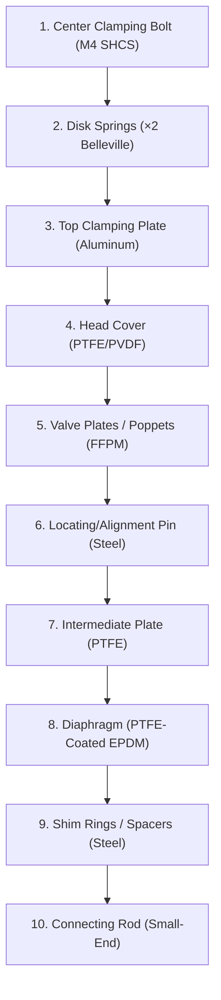

# Detailed Part Specifications — KNF Laboport N820 Diaphragm Vacuum Pump

This document compiles the exhaustive physical and mechanical specifications for every individual component of the KNF Laboport N820 diaphragm vacuum pump. It serves as the definitive reference for 3D procedural modeling, BOM validation, and maintenance simulation.

---

## 1. Pump Head Assembly (8 Parts per Head × 2 Heads)

The pump head is a multi-layered sandwich assembly designed for chemical compatibility and leak-free vacuum containment.



### 1.1 Center Clamping Bolt
* **Type:** Socket Head Cap Screw (SHCS), hex drive.
* **Size:** M4 thread.
* **Length:** 25 mm.
* **Material:** Stainless Steel (A2/A4 grade) or High-Tensile Carbon Steel.
* **Pitch:** 0.7 mm (Standard metric coarse).
* **Location:** Passes through the center of the top plate to thread directly into the intermediate plate/crank adapter.
* **Tightening Torque:** 25 Ncm (0.25 Nm) for version-specific plate center tensioning, or up to **2.5–3.5 Nm** for structural diaphragm clamping.

### 1.2 Disk Springs (Belleville Washers)
* **Quantity:** 2 per head.
* **Type:** Belleville spring washers (conical disk springs).
* **Dimensions:**
  * **Inner Diameter (d):** 4.2 mm (clearance for M4 bolt).
  * **Outer Diameter (D):** ~10.0 mm.
  * **Thickness (t):** ~1.0 mm.
  * **Total Height (h):** ~1.2 mm.
* **Material:** Spring Steel (50CrV4 or Stainless Steel 301).
* **Arrangement:** Arranged in **opposing (back-to-back, `()`)** configuration to provide high spring force with small deflection. This maintains tension on the plastic/PTFE stack under thermal expansion/contraction and continuous reciprocating vibration.

### 1.3 Top Clamping Plate
* **Material:** Cast or machined Aluminum (anodized).
* **Dimensions:**
  * **Shape:** Hexagonal or circular flange matching the head plate profile.
  * **Diameter:** 56 mm.
  * **Thickness:** 3 mm.
  * **Center Hole:** Ø4.5 mm (clearance for M4 central screw).
* **Function:** Evenly distributes the high clamping force of the central screw to the underlying PTFE/PVDF head cover, preventing cold flow (deformation) of the plastic.

### 1.4 Head Cover
* **Material:** Solid PVDF (light gray) or PTFE (white/translucent) for high chemical resistance.
* **Dimensions:**
  * **Diameter:** 56 mm.
  * **Height:** 16 mm.
* **Internal Features:**
  * Double-bore channels for gas intake and discharge.
  * Internal recesses for the check valves (poppets) and sealing faces.
  * Threaded sockets on side faces for pneumatic union elbow adapters.
  * Aligning recess for the guide pin.

### 1.5 Valve Plates / Poppets & Springs
* **Check Valves (×2 per head):**
  * **Type:** Conical spring-loaded check valves (poppets).
  * **Material:** FFPM / FFKM (perfluoroelastomer) for universal chemical compatibility.
  * **Outer Diameter:** 10 mm.
  * **Thickness:** 3 mm.
* **Internal Check Valve Springs:**
  * **Type:** Conical compression spring.
  * **Wire Diameter:** 0.3 mm.
  * **Coil Diameter:** 6 mm (base) / 4 mm (top).
  * **Free Length:** 6 mm.
  * **Active Coils:** 4.
  * **Spring Rate:** ~0.5 N/mm.
  * **Material:** Stainless Steel 301/316.

### 1.6 Locating Pin (Guide Pin)
* **Material:** Hardened Steel dowel pin.
* **Dimensions:** Ø2.8 mm × 8 mm length.
* **Function:** Pressed into the intermediate plate and slots into a mating hole in the head cover. Ensures perfect angular alignment of the gas channels during assembly and prevents rotational shearing of the sealing surfaces.

### 1.7 Intermediate Plate
* **Material:** Solid virgin PTFE (white).
* **Dimensions:** Ø56 mm × 12 mm.
* **Features:**
  * Machined valve seats matching the conical FFPM poppets.
  * Internal drilling for the gas ballast path (on heads equipped with ballast).
  * Peripheral O-ring groove for head sealing.

### 1.8 Convoluted Diaphragm
* **Material:** PTFE-coated EPDM rubber (composite).
  * **Top Face (Wetted):** Thin layer of white/translucent PTFE film (for chemical protection).
  * **Substrate (Structural):** Convoluted black EPDM rubber (for high flexibility and cycle life).
* **Dimensions:**
  * **Overall Diameter:** 50 mm.
  * **Thickness:** 4 mm (convoluted area) / 8 mm (central clamping zone).
* **Crank Connection Stud:**
  * **Type:** Integrated metal threaded stud molded directly into the diaphragm center.
  * **Size:** M6 thread (or M5 in some variants).
  * **Thread Length:** 12 mm.

### 1.9 Diaphragm Spacers (Shim Rings)
* **Type:** Precision metal shims.
* **Dimensions:**
  * **Inner Diameter:** 6.2 mm (clearance for diaphragm stud).
  * **Outer Diameter:** 12.0 mm.
  * **Thicknesses:** Thick (1.0 mm) and Thin (0.1 mm, 0.2 mm).
* **Function:** Placed over the diaphragm's integrated stud before threading it into the connecting rod. Adjusts the clearance gap at Top Dead Center (TDC) to less than 0.1 mm, maximizing compression ratio and ultimate vacuum performance.

### 1.10 Head Cover Screws
* **Quantity:** 4 per head (total 8).
* **Type:** M4 × 20 mm Socket Head Cap Screws (SHCS) or cheese head screws.
* **Material:** A2 Stainless Steel.
* **Tightening Torque:** **2.0–3.0 Nm** (must be tightened in a cross-pattern to prevent uneven loading).

---

## 2. Internal Drive & Crank Mechanism

Transforms the motor's rotational energy into reciprocating linear stroke.

```
[BLDC Motor Shaft (Ø12)]
       │
[Jaw Coupling (Aluminum + Polyurethane Spider)]
       │
[Rotor Shaft (Ø12 × 130 Steel)]
       ├── [Front Eccentric Cam (+4mm offset, Ø28)] ── [Needle Bearing] ── [Front Rod]
       └── [Back Eccentric Cam (-4mm offset, Ø28)]  ── [Needle Bearing] ── [Back Rod]
```

### 2.1 Rotor Shaft
* **Material:** High-carbon steel (precision ground and polished).
* **Dimensions:** Ø12 mm diameter × 130 mm length.
* **Keyways:** Machined keyway at motor coupling end.

### 2.2 Shaft Coupling (Two-Piece Jaw Type)
* **Coupling Hubs (×2):**
  * **Material:** Machined Aluminum alloy.
  * **Dimensions:** Ø24 mm outer diameter × 15 mm length each.
  * **Bore:** 12 mm H7 clearance fit.
* **Elastomer Insert (Spider):**
  * **Material:** Polyurethane (92 Shore A hardness, red or yellow).
  * **Dimensions:** Ø23 mm diameter × 6 mm thickness.
  * **Function:** Backlash-free torsional dampening; compensates for up to 0.5 mm radial misalignment.

### 2.3 Eccentric Cams (×2)
* **Material:** Hardened Steel.
* **Dimensions:**
  * **Outer Diameter:** 28 mm.
  * **Width:** 12 mm.
  * **Bore:** 12 mm (keyed to rotor shaft).
* **Offset:** 4 mm (generates a total diaphragm travel/stroke of 8 mm).
* **Angular Phase:** Set exactly **180° apart (counter-phase)** to cancel primary vibration forces and provide continuous suction/discharge strokes.

### 2.4 Needle Roller Bearings (×2)
* **Type:** Drawn cup needle roller bearing (radial cage assembly).
* **Part Number:** Standard K16×20×10 or similar.
* **Dimensions:**
  * **Inner Diameter (ID):** 16 mm (eccentric journal).
  * **Outer Diameter (OD):** 20 mm.
  * **Width:** 10 mm.
* **Lubrication:** Sealed, high-temperature grease.

### 2.5 Connecting Rods (Pleuel) (×2)
* **Material:** High-strength Cast Aluminum alloy (die-cast).
* **Dimensions:**
  * **Big-End (Crank):** Ø20 mm bore.
  * **Small-End (Diaphragm):** Ø10 mm bore.
  * **Center-to-Center Length:** 75 mm.
  * **Cross-section:** I-beam profile (10 mm width × 6 mm depth).

### 2.6 Thrust Bearings (×2)
* **Type:** Miniature thrust ball bearing.
* **Location:** At the rod small-end, between the rod face and the diaphragm base plate.
* **Dimensions:**
  * **Inner Diameter (ID):** 10 mm.
  * **Outer Diameter (OD):** 20 mm.
  * **Thickness:** 2 mm.
* **Material:** Brass cage with Chrome Steel balls.

---

## 3. Enclosure, Chassis & Mounts

### 3.1 Housing Split Line Screws
* **Quantity:** 8.
* **Type:** M4 × 12 mm self-tapping pan head screws.
* **Material:** Zinc-plated Carbon Steel.
* **Function:** Clamps the upper ABS shell to the lower ABS baseplate.
* **Torque:** 1.5–2.5 Nm.

### 3.2 Anti-Vibration Rubber Feet (×4)
* **Material:** SBR Rubber (70 Shore A durometer, black).
* **Dimensions:** Ø20 mm base diameter × 15 mm height.
* **Threaded Stud:** M6 × 10 mm threaded stud molded into the rubber.
* **Mounting:** Threaded directly into brass inserts pressed into the lower housing shell.

### 3.3 Carry Handle
* **Material:** Textured polypropylene shell with an internal 2.0 mm structural steel reinforcing spine.
* **Dimensions:** 200 mm length × 30 mm width × 15 mm height.
* **Fasteners:** 2 × M5 × 12 mm countersunk hex screws clamping from the underside of the upper housing.

### 3.4 Exhaust Grill
* **Material:** Mild steel sheet (0.8 mm thickness), powder-coated matte black.
* **Dimensions:** 42 mm width × 32 mm height.
* **Pattern:** Hexagonal mesh (1.5 mm hex holes on 2.0 mm pitch).

---

## 4. Controls & Pneumatics

### 4.1 Gas Ballast Knob
* **Material:** Black PVDF plastic, injection-molded knurled texture.
* **Dimensions:** Ø20 mm diameter × 10 mm depth.
* **Stem:** D-profile shaft flat, secured with an internal brass grub screw (M3).

### 4.2 Speed Control Dial (Potentiometer)
* **Type:** 10 kΩ linear rotary potentiometer.
* **Body Dimensions:** Ø10 mm cylinder.
* **Stem:** 6 mm split shaft.
* **Knob:** Ø12 mm black aluminum cap with indicator line.

### 4.3 Vacuum Gauge
* **Type:** Bourdon Tube analog vacuum gauge (Class 1.6).
* **Dial Diameter:** 50 mm.
* **Connection:** 1/8" NPT brass bottom mount.
* **Range:** 0 to −1.0 bar (0 to −760 mmHg).
* **Sealant:** Requires 3–4 wraps of 0.1 mm PTFE thread tape on NPT threads.
* **Installation Torque:** **3.0–5.0 Nm** (Do not over-torque to avoid cracking the plastic bezel housing).

### 4.4 Pneumatic Connections
* **KF25 Inlet Flange:**
  * **Material:** Stainless Steel 304 or PVDF.
  * **Bore:** 25 mm.
  * **Standard:** ISO 2861.
* **Exhaust Muffler:**
  * **Type:** Cylindrical porous sintered metal silencer.
  * **Dimensions:** Ø28 mm outer diameter × 40 mm length.
  * **Thread:** G 1/4" BSPP or G 3/8" BSPP.
  * **Gasket:** Neoprene flat annular washer (Ø30 mm OD × Ø20 mm ID × 2 mm thick).
